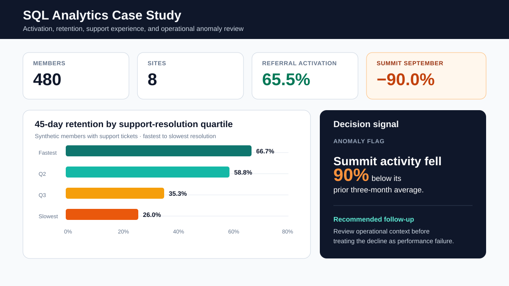

# SQL analytics case study

A runnable SQL case study for a fictional multisite service organization. The project builds a normalized SQLite database, creates a reusable metric layer, and answers practical questions about activation, retention, site performance, support experience, and emerging operational risk.

All data are deterministic and synthetic. No real customer, patient, employee, or organization information is included.

## Business questions

- Which acquisition channels produce members who activate within 14 days?
- How does monthly retention change across signup cohorts?
- Which sites are meeting service targets, and where is performance changing?
- Is slow support resolution associated with weaker 45-day retention?
- Which site-months warrant review because activity dropped below recent history?

## Data model

~~~mermaid
erDiagram
    SITES ||--o{ MEMBERS : serves
    MEMBERS ||--o{ SERVICE_EVENTS : generates
    MEMBERS ||--o{ SUPPORT_TICKETS : opens
~~~

The database contains 8 sites, 480 members, service-event history, and support tickets spanning 2025. The generator includes realistic variation by site and acquisition channel, plus a deliberately emerging decline at one site so the anomaly query has something meaningful to identify.

## Results at a glance

Read the [executed SQL report](outputs/report.md) for definitions, denominators, and interpretation boundaries.

| Signal | Synthetic result |
|---|---:|
| Referral 14-day activation | 65.5% |
| Outreach 14-day activation | 40.0% |
| Fastest support quartile: 45-day retention | 66.7% |
| Slowest support quartile: 45-day retention | 26.0% |
| Summit September activity versus prior three months | −90.0% |

These signals are descriptive. The decision memo separates operational follow-up from causal interpretation.

## Repository structure

~~~text
sql/
  00_schema.sql
  01_metric_views.sql
  02_data_quality.sql
  03_activation_funnel.sql
  04_cohort_retention.sql
  05_site_performance.sql
  06_support_experience.sql
  07_anomaly_review.sql
scripts/
  build_demo_database.py
  run_queries.py
tests/
  test_case_study.py
outputs/
  saved query results
docs/
  data-model.md
  metric-definitions.md
  decision-memo.md
~~~

## Run it

Only Python's standard library is required.

~~~bash
python scripts/build_demo_database.py
python scripts/run_queries.py
python scripts/render_results.py
python -m unittest discover -s tests -v
~~~

Or run the complete workflow:

~~~bash
make all
~~~

The Python code is a lightweight reproducibility harness; the analytic work is expressed in SQL.

## SQL techniques demonstrated

- multi-table joins and referential QA
- common table expressions
- conditional aggregation
- reusable views
- date arithmetic
- window functions including `LAG`, rolling averages, `RANK`, and `NTILE`
- cohort analysis
- metric-layer design
- anomaly flags
- tested output contracts

The syntax is intentionally interview-defensible and uses SQLite-compatible SQL. The logic translates readily to other analytical warehouses, although date functions and a few casting details would need dialect-specific changes in systems such as Athena/Trino, Snowflake, or PostgreSQL.

## Findings

The saved outputs are interpreted in [the decision memo](docs/decision-memo.md). Because the generator is deterministic, reviewers can recreate every table and confirm each statement.

## Limitations

This case study demonstrates descriptive operational analytics. Associations between channel, support experience, and retention are not causal effects. A production analysis would also address metric ownership, late-arriving data, slowly changing dimensions, privacy rules, and warehouse-specific performance optimization.

## License

MIT
