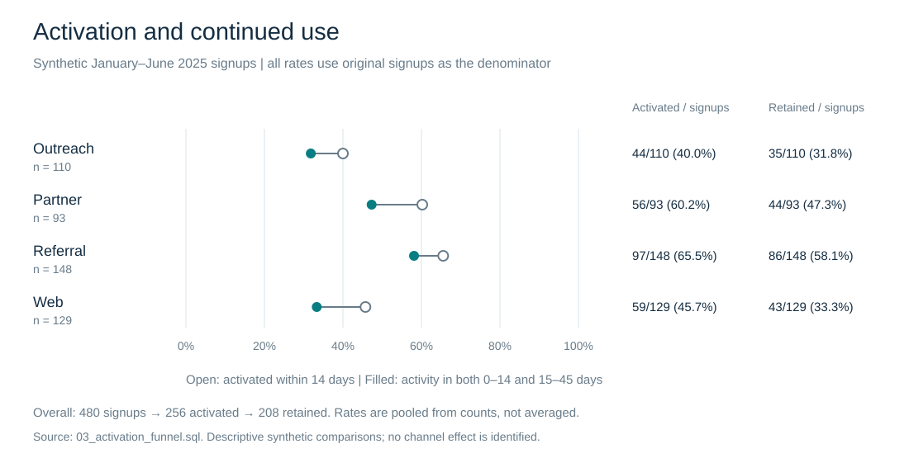
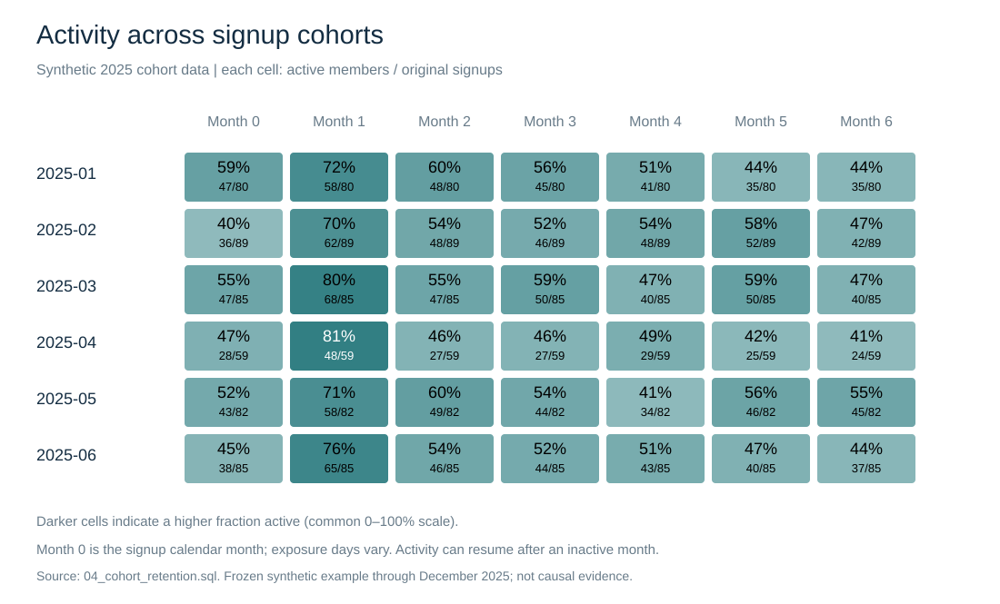

# Executed SQL analysis report

## Question and data

Which acquisition channels activate and retain members, and how does calendar-month activity differ across cohorts? The normalized SQLite case study contains 480 deterministic synthetic members across eight sites. The analysis window is frozen to 2025; a production extension must parameterize dates and censor incomplete follow-up windows.

## Activation and continued use

Activation requires a completed event from signup through day 14. Retention requires both activation and a completed event during days 15–45. Both rates divide by all original signups, not by the activated subset. Aggregate rates pool counts across months.

## Calendar-month activity

Monthly activity counts any completed service in the calendar month. Returning members can reappear, so this is not monotone survival retention. Month zero has unequal exposure time depending on signup day. The explicit denominator remains the original cohort, including inactive members.

## Checks, interpretation, and reproduction

Foreign keys, database grain, zero-failure QA queries, bounded rates, and the deliberately constructed Summit anomaly are integration-tested. Figure checks validate nested funnel counts and unique cohort cells; CI verifies that regenerated figures and this report match committed files.

The [decision memo](../docs/decision-memo.md) discusses support experience and operational review. These descriptive synthetic patterns do not establish channel or support-speed effects. Counts are complete for the constructed fixture; no population sampling confidence intervals are implied.

Run `python scripts/build_demo_database.py`, `python scripts/run_queries.py`, `python scripts/render_results.py`, and `python -m unittest discover -s tests -v`. No third-party Python packages are required. [Funnel data](03_activation_funnel.csv) · [Cohort data](04_cohort_retention.csv) · [Metric definitions](../docs/metric-definitions.md).
